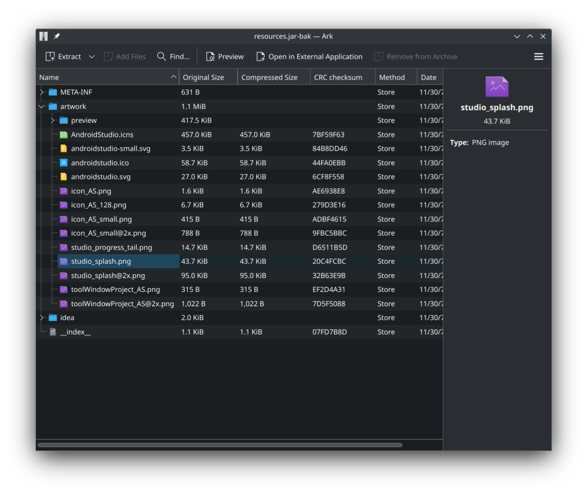

---
author:
- LTSlw
- dedfaf
tags:
- android
date: 2024-02-21
lastmod: 2024-05-09
---

# 安装Android Studio

`Android Studio`是Android官方推出的IDE，用于Android开发，被广泛使用。绝大部分工作都可以在里面完成，比如编写代码、设计UI、构建应用、模拟不同的设备调试

## 配置要求

不同的平台的配置要求略有不同，总结一下

最低配置：

- 8GB RAM
- 8GB DISK
- 1280*800的屏幕
- 不太旧的cpu和操作系统

推荐配置：

- 16GB RAM
- 16GB SSD
- 1920*1080的屏幕

只看最低配置的话，其实要求不高，电脑配置虽然越高越好，但不必为此焦虑。详细的配置要求可以看[文档](https://developer.android.com/studio/install)

## 安装

官方的[文档](https://developer.android.com/studio/install)已经非常简单了，可以说是已经做到了无脑安装，推荐至少将文档看一遍


### Arch

下面介绍一个Arch Linux使用包管理器安装Android Studio的方法。Android Studio不是真正意义上的自由软件，因此不在官方源中，但可以在[AUR](https://aur.archlinux.org/packages/android-studio)中找到它

#### 启用multilib源

`Android SDK`依赖32位库，所以需要先启用`multilib`源，可以编辑`/etc/pacman.conf`

```
[multilib]
Include = /etc/pacman.d/mirrorlist
```

#### 安装本体和依赖

``` shell
yay -S android-studio android-sdk-cmdline-tools-latest-dummy android-sdk-build-tools-dummy android-sdk-platform-tools-dummy android-platform-dummy android-emulator-dummy
```

使用dummy包是允许`SDK Manager`管理SDK的同时安装好依赖，避免Pacman和SDK Manager同时插手SDK的管理，造成混乱

#### 设置网络

安装之后，即可启动Android Studio，此时会尝试联网，如果联网失败会有设置proxy的弹窗。填写完proxy之后建议测试连接，大量的组件要从`dl.google.com`下载，网络环境很重要

#### 安装组件

其实dummy包还帮我们做了添加`PATH`的工作，但它默认SDK存放在`/opt/android-sdk`，Android Studio默认将SDK存放在`~/Android/Sdk`，如果希望利用上自动配置的`PATH`，可以遵循以下步骤：

1. mkdir /opt/android-sdk
2. chmod 777 /opt/android-sdk
3. `Install Type`可以选择`Custom`，在下一页`SDK Components Setup`中把`Android SDK Location`改为`/opt/android-sdk`


#### 完成安装

接下来你需要同意许可协议并等待下载结束

[参考 Arch Wiki](https://wiki.archlinux.org/title/Android#Android_Studio)

### Windows

Android Studio在Windows的下载安装非常简单(傻瓜操作)，只需要使用官方的安装程序就能一键下载本体+组件

#### 下载

直接到[官方首页](https://developer.android.com/studio?hl=zh-cn)下载安装包

#### 安装

运行android-studio-版本号-windows.exe

打开安装程序后等待一小会，如果联网失败会提示是否要配置代理。Android Studio组件的安装需要从`dl.google.com`下载，这时我们需要手动设置让Android Studio使用代理

在安装过程中设置过代理配置会自动保存，安装后就不用再设置一次

之后在安装程序中选择所有需要安装的组件（主要是Android SDK），注意安装Android SDK的路径不能带有空格，否则会影响NDK工具的使用

## 配置

配置存放位置：

- ~/.android
- ~/.config/Google/AndroidStudio2023.1

打开Android Studio设置可以按快捷键`Ctrl+Alt+S`

### 更改主题

`Appearance & Behavior` -> `Appearance` -> `Theme`

### New UI

`Appearance & Behavior` -> `New UI`

新版UI还是含好看的，可以尝试一下，很多known issues我认为是可以接受的

### 背景图片

`Appearance & Behavior` -> `Appearance` -> `Background Image...`

### 网络设置

`Appearance & Behavior` -> `System Settings` -> `HTTP Proxy`

### 内存设置

`Appearance & Behavior` -> `System Settings` -> `Memory Settings`

这里应该按照电脑配置调整，大内存运行会更流畅，但受到电脑内存大小限制

### 快捷键设置

`Keymap`

### 管理插件

`Plugins`

### 配置低的电脑配置

- 减少分配内存，可以参考[内存设置](#内存设置)
- 开启`Power Save Mode`，`File` -> `Power Save Mode`，会关闭一部分功能
- 减少代码提示，`Editor` -> `Inspections`，去掉不需要的选项
- 使用一台安卓设备调试
- 关闭并行构建，`Build, Execution, Deployment` -> `Gradle-Android Compiler` -> `Compile independent modules in parallel`

[相关文档](https://developer.android.com/studio/intro/studio-config#low_memory)

### 安装中文语言包

Android Studio基于IDEA，IDEA是有中文支持的，但IDEA的版本需要和语言包版本匹配，不会自动更新，因此每次更新都需要手动安装新版语言包。而且语言包限定于对IDEA汉化，就算装了语言包，也不能做到完全汉化。如果可以接受英文，那么就不要装语言包了，可以省去一些麻烦

1. `菜单` -> `Help` -> `About`，查看`Build`开头的版本号
2. 去[JetBrains MarketPlace](https://plugins.jetbrains.com/plugin/13710-chinese-simplified-language-pack----)下载接近版本号的汉化包
3. 在设置中，`Plugins` -> `齿轮图标` -> `Install Plugin from Disk...`，选择刚才下载到的zip包
4. 重启Android Studio

> 如果想安装其他IDEA扩展也是同样流程，但务必清楚自己做了什么

## 卸载

### Linux

将安装的步骤反过来走一遍即可，可能需要删除的：

- Android Studio本体
- Android SDK，默认位置：`~/Android/Sdk`
- ~/.android
- ~/.gradle
- `~/.local/share`，`~/.config`，`~/.cache`下的`Android Open Source Project`，`Google/AndroidStudio*`

### Windows

使用卸载程序卸载Android Studio后，还会在以下位置留下文件：

- %USERPROFILE%\\.android
- %USERPROFILE%\\.gradle
- %APPDATA%\\Google\\AndroidStudio*
- %APPDATA%\\JetBrains
- %USERPROFILE%\\AppData\\Local\\Android
- %USERPROFILE%\\AppData\\Local\\Android Open Source Project
- %USERPROFILE%\\AppData\\Local\\Google\\AndroidStudio*
- %USERPROFILE%\\AppData\\Local\\JetBrains

## 常见问题

由于Android Studio是大量组件组成的结合体，使用过程中可能遇到的各种奇葩问题，下面列举了一些收集到的问题及解决思路，**持续更新，欢迎补充**

遇到问题请注意**看报错信息**。绝大部分遇到的错误都有前人总结的经验，此话无论如何不可能包含所有情况，提出的解决方法也不一定能完美解决你的问题。遇到问题可以自己把报错信息放到搜索引擎中来寻找解决方法

### 代理配置不正确

**绝大部分的问题都是网络问题**，遇到奇奇怪怪的问题解决不了，都可以怀疑文件下载过程出了问题。保证网路稳定之后，可以按照[卸载](#卸载)中的步骤，清理掉Android Studio的文件，参考下面的内容配置代理，重新安装一遍


配置问题，如果是手动设置代理设置，务必注意自己的配置类型是什么。

配置好后点左下角的`Check connection`连一下谷歌之类的网址检查自己的代理挂上了没有，如果你的代理有流量监控之类的功能也可以在下载时检查到底是怎么下载的

很多问题例如

- zip END header not found: gradle.zip下载时断断续续导致文件损坏，需要删掉gradle user home里面的东西重新下载

都大概率是由于代理其实没有挂上，下东西没成功导致的

### 虚拟机常见问题

在此罗列一些本人周边同学遇到问题

- 虚拟机无法启动：

    虚拟机无法启动的原因太比较多，如果遇到了此类问题请根据自己的报错或实际情况分析原因，下面是一些常见原因：
  - C盘空间不足
  - 没有关闭windows的虚拟机服务hyper-V
  - BIOS中没有打开CPU对虚拟机支持的选项
  - 内存太小

- 虚拟机下载完后不显示

    可能是代理不正确导致的

- 虚拟机开机，电脑直接重启

    目前还没找到这个玄学问题的原因，但是通过每次cold boot虚拟机可以避免

### Run app时虚拟机没反应

*检查虚拟机是否真的收到了app，目前一个比较玄学的原因是因为连接BIT-mobile无线网时就是传不过去*

## 替换启动图

*这不是受到官方支持的功能，我自行摸索得到，不一定在以后的版本也可用*

启动图存放位置：`lib/resources.jar`

`jar`实质上是zip压缩包，我们替换掉其中的`/artwork/studio_splash*.png`即可



Android Studio预置的启动图为`16:10`，`2x`的大小是另一个的两倍，自制的启动图也可以按照这个规格制作


我制作的一个启动图（图源：[Pixiv@竹ちょ](https://www.pixiv.net/artworks/118523864)）：

