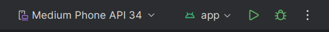

---
author:
- LTSlw
tags:
- android
date: 2024-04-24
lastmod: 2024-04-24
---

# Hello World

本话使用Andorid Studio运行内置的Hello World模板程序，熟悉一下Andorid Studio的操作，不需要自己写代码

## 新建工程

1. 点击`New Project`新建工程

2. 选择工程类型，这里选`Empty Views Activity`

3. 填写工程信息，这里注意选择合适的API版本，可以点击`Help me choose`查看各API版本的占有率，一般要保证在能够使大部分用户可用的情况下使用较新的API版本

4. 点击`Finish`创建工程，会经历比较长的sync过程

## 运行调试

点击`Run`或按`Shift+F10`开始调试，Android Studio会启动虚拟机，并在右侧会自动编译运行，相应的按钮会转变为`Restart`和`Stop`

