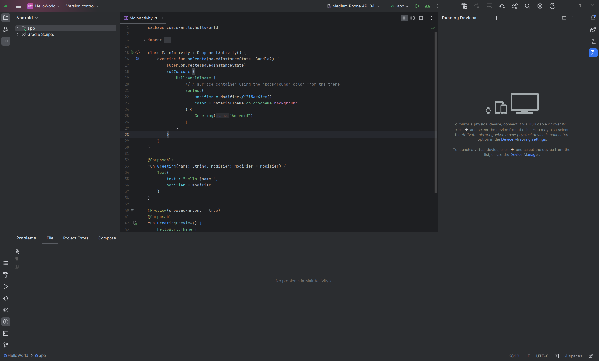
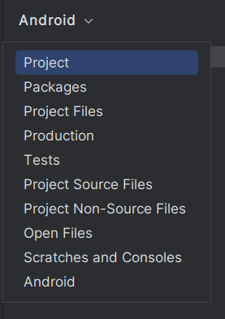
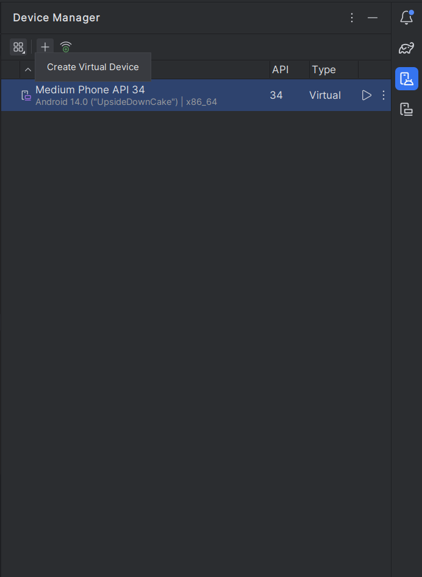
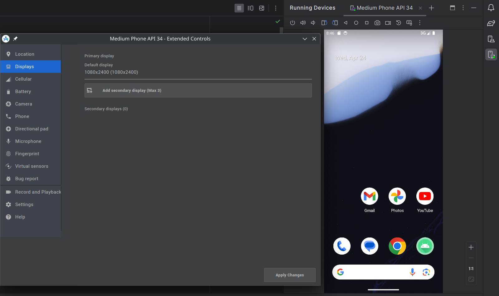

---
author:
- LTSlw
tags:
- android
date: 2024-04-24
lastmod: 2024-04-24
---

# Android Studio使用

本话以Android Studio的New UI为准介绍

Android Studio的功能按键集中在窗口的四周，鼠标悬停可以看到描述

## Project

`Project`包含多种查看工程的方式比较常用的是`Project`、`Android`。`Android`包含了安卓开发的组织结构，`Project Files`是实际的目录结构

## TODO

工程中留下的TODO

## Build

包含`Sync`、`Build`相关信息，有时Android Studio打开工程是Sync会失败，即可进入这里重试

## Debug

调试时查看局部变量的值

## Logcat

接收虚拟机中的日志

## Problems

查看错误和警告

## Terminal

运行终端

## Version Control

版本控制,Android Studio支持多种版本控制系统，例如git，Android Studio会自动生成`.gitignore`避免提交不必要的文件

## Device Manager

管理用于调试的设备，调试的设备可以是真实设备，也可以是虚拟机。真实设备可以通过usb或wifi连接打开了adb的安卓设备（一般在开发者选项中）。虚拟机可以点击`Create Virtual Device`选择不同规格的设备

## Running Devices

查看和操作运行中的设备

## 参考资料

[文档](https://developer.android.com/studio/intro/user-interface)