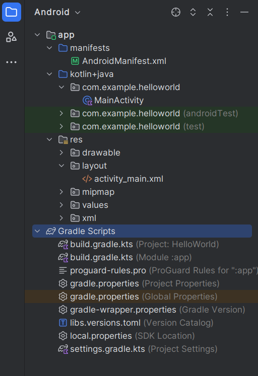

---
author:
- LTSlw
tags:
- android
date: 2024-04-25
lastmod: 2024-04-25
---

# Android Project

一般使用Android视图查看工程

## AndroidManifest.xml

`AndroidManifest.xml`记录了app的基本信息，包括应用的图标、权限、Acticity等

## kotlin+java

包含了实际的kotlin代码，也就是说应用的计算大部分都包含在这里

## res

`res`是`resources`的缩写，包含了资源文件，比如图标、图片、音频、页面布局、i18n、颜色等。也就是说，res负责了界面部分，和kotlin代码分离。res的内容可以在代码中用`R`访问，因此还经常用于保存各种常量，集中管理

## gradle scripts

Gradle是java流行的构建工具，负责编译、管理依赖等。打开`build.gradle.kts`可以看到里面记录了Sdk版本和一些其他信息，部分内容也可以在`Project Structure`（`Ctrl+Alt+Shift+S`）中管理