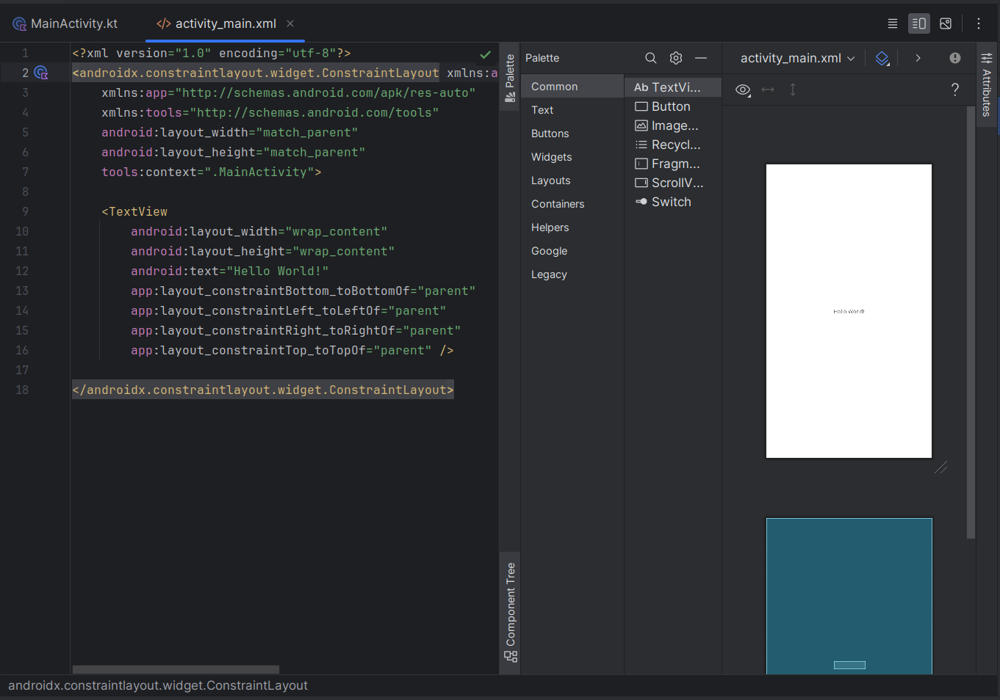
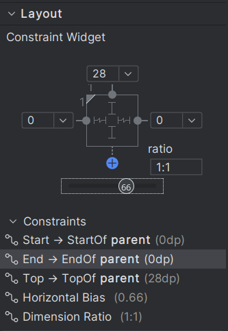
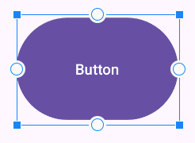
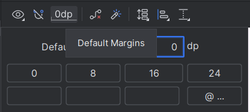
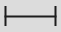
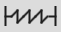
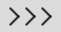
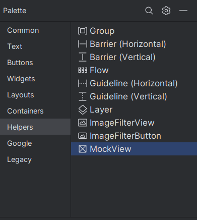
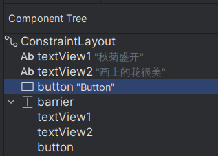
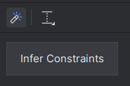

---
author:
- LTSlw
tags:
- android
date: 2024-04-25
lastmod: 2024-04-27
---

# xml布局

减少布局嵌套可以提高渲染速度，降低复杂性（扁平化），推荐使用ConstraintLayout

## Android控件

所有的Android控件的基类都是`View`，其中有一个子类`ViewGroup`可以嵌套其他的`View`和`ViewGroup`以实现布局

### 盒子模型

一个控件有外到内分为`margin`、`padding`、`content`三部分，`margin`使控件外围额外占用一些空白，`content`是控件边缘向内收缩使`content`和边缘保持一段距离

- View支持padding，但是不支持margin
- ViewGroup支持padding和margin

### 对齐方式

控制控件的对齐方式可以由以下的属性控制

- `layout_gravity`：该控件与上级级控件的对齐方式
- `gravity`：布局内部子控件对齐与排列方式

它们可以包含下列值的一个或多个

- `top`
- `bottom`
- `start`
- `end`
- `right`
- `left`
- `center`
- `fill`
- `fill_horizontal`
- `fill_vertical`
- `clip_horizontal`
- `clip_vertical`
- `center_horizontal`
- `center_vertical`

`start`/`end`和`left`/`right`的区别是，文字从右向左（RTL）书写语言，会以`right`为`start`，`left`为`end`

### visibility

控制控件显隐，允许以下的值

- `gone`：隐藏控件，且控件不占用屏幕空间
- `invisible`：隐藏控件，但控件依然占用空间
- `visible`：显示控件

## 布局单位

### Density-independent pixels

`Density-independent pixels`，简称`dp`，dp与dpi相关，1dp在160dpi下等价于1px（`px = dp * (dpi / 160)`），目的是在不同像素密度的屏幕上相同控件显示大小一致，一般用于调整控件的大小和间距

### Scalable pixels

`Scalable pixels`简称`sp`，默认情况下`1sp = 1dp`，但会根据用户设置调整，一般用于显示文字

## 颜色

### 预定义颜色

- `BLACK`
- `BLUE`
- `CYAN`
- `DKGRAY`
- `GRAY`
- `GREEN`
- `LTGRAY`
- `MEGENTA`
- `RED`
- `TRANSPARENT`
- `WHITE`
- `YELLOW`

### 十六进制表示

布局文件中可以使用`#RRGGBB`表示颜色，代码中可以使用`0xAARRGGBB`表示

### Color类

导入Color类可以使用更丰富的颜色

```
import android.graphics.Color
```

[相关文档](https://developer.android.com/reference/android/graphics/Color)

## Android Studio中编辑布局



- `Code`/`Design`/`Split`（右上角）：只查看源xml/只查看可视化的界面/同时查看两者
- `Palette`：可以浏览所有可以使用的控件，拖动到右侧添加控件
- `Attributes`：查看和编辑选中控件的属性，比如宽高、文字大小等
- `Component Tree`：控件列表

> 调整控件宽高时除了指定dp值，还可以使用`wrap_content`和`match_parent`，分别表示恰好包裹content和填充父控件

### tools前缀

Design中显示的布局可能和实际不一样，`tools`前缀的属性不会在最终的程序中显示出来，但会被Design使用，方便设计

``` xml
<Button
    android:id="@+id/button2"
    android:layout_width="wrap_content"
    android:layout_height="wrap_content"
    android:text="Button"
    tools:layout_editor_absoluteX="18dp"
    tools:layout_editor_absoluteY="80dp" />
```

这个Button在Design中会显示在屏幕中间，但由于没有约束，实际运行会显示在左上角

## ConstraintLayout

Constraint（约束），代表父子（或兄弟）控件之间的连接或对齐方式。每个控件，都可以设置上下左右四个方向的constraint

constraint可以在`Attributes`中的`Constraint Widget`设置和查看



也可以在设计窗口中点击白色圆圈设置



### default margins

默认的页边距，点击上方的按钮调整



### constraint

constraint有3种，可以单击Constraint Widget中4个圆点内侧的按钮切换（鼠标悬停会显示当前constraint类型），外侧的数字为固定保留的空白大小，点击圆点删除constraint

- `Fixed`（）：固定大小（少用）
- `Match Constrains`（）：在满足约束的情况下使控件填充尽可能大的空间
- `Warp Content`（，默认）：包裹content的情况下占用尽可能小的空间

### bias

分为水平（`Horizontal Bias`）和垂直（`Vertical Bias`）两种，控件在约束的范围内可能不足以确定它的位置，bias表示控件在可能范围内左右和上下的百分比（示例图中显示`66`的滑块），默认值都为`50`，即在可能的范围内居中

### raito

设定控件的长宽比，点击Constraint Widget中左上角的小三角，然后在右下角的raito中输入长宽比。某些constrains设置可能会导致不能设置raito，这时小三角也不会显示

> 可以用于设置图片控件的长宽比为16:9，以保证显示的图片不变形

### 基线对齐

右键需要基线对齐的控件，点击`Show Baseline`，把需要对齐的控件的基线用鼠标拖动连接起来

### Guideline

引导线可以用于对齐控件，只需把控件的constraint连接到guideline即可。guideline可以在`Palette`中的`Helpers`中添加



### barrier

障碍，和guideline有类似之处，区别是barrier不是固定的，可以相对与一些控件移动。barrier比较重要的属性是`constraint_referenced_ids`（barrier参考的控件的id）和`barrierDirection`（barrier的方向）

`constraint_referenced_ids`可以在`Component Tree`中把参考的控件拖动到barrier下



`barrierDirection`允许以下的值：`top`、`bottom`、`start`、`end`、`left`、`right`，表示barrier在参考的控件的什么方向，比如`bottom`就表示barrier会出现在这些控件的下方

### group

控件组，可以在Helpers中添加组，控件组中的控件可以整组控制，比如控制显示和隐藏

### chain

约束链可以把多个控件水平或垂直约束在一起，比如多个控件并排居中，用约束链就非常简单。创建chain可以选中要创建chain的控件，右键 -> `Chains` -> `Create Chain`。之后可以在右键 -> `Chains` -> `Chain Style`中修改chain模式，chain共有3种模式：

- `spread`：被chain连接的控件均匀分布，在chain两端留有均匀的空白
- `spread_inside`：被chain连接的控件均匀分布，整个chain在满足constraint的情况下占用尽可能大的空间
- `packed`：被chain连接的控件之间的距离尽可能短

### flow

流式布局，超出一行的控件会自动转移到下一行，flow可以在Helpers中添加，和flow有关比较重要的的参数有以下几个

- `orientation`：控件首选的排列方向，可能的值为`horizontal`（水平）和`vertical`（垂直）（下面的内容默认使用水平排列，垂直排列自行把“行”替换为“列”理解）
- `flow_wrapMode`：flow的方式，可能的值为：`none`（内部的控件排列为一行，相当于创建了一个chain），`chain`（超出范围的控件换行，相当于创建了多条chain），`aligned`（在chain的基础上会对齐控件）
- `flow_maxElementsWrap`：一行的最大控件数量
- `flow_horizontalGap`/`flow_verticalGap`：控件之间水平和垂直的间隔
- `flow_horizontalAlign`/`flow_verticalAlign`：控件之间水平和垂直的对齐方式
- `flow_horizontalStyle`/`flow_verticalStyle`：水平和垂直的flow方式，可能的值为`spread`、`spread_inside`、`packed`语义和chain中的介绍一致

#### 加权

当chain上的控件在chain的方向上的约束是Match Constrains时，可以给控件加权调整它占用的空间大小，具体调整的属性是`layout_constraintHorizontal_weight`和`layout_constraintVertical_weight`，控件会按照比例占用链上的空间

### 自动推断约束

把控件拖动到差不多的位置之后，选中并按`Infer Constraints`可以自动添加约束



## LinearLayout

`LinearLayout`，线性布局，内部的控件按照某种顺序排列（水平或垂直）。多个LinearLayout相互嵌套可以实现多个方向的布局

- `layout_weight`：调整控件占LinearLayout的比例

## RelativeLayout

通过指定特定控件相对于其他控件（兄弟控件或父级控件）的相对位置来布局

## TableLayout

表格式布局，把包含的子控件以行和列的形式进行排列，表格的列数为每一行的最大列数。TableRow代表一行，每行可以包含一个或多个Cell，每个Cell放置一个View控件

可以调整列缩放或者让控件占据多个列调整比例

## FrameLayout

无法为子控件指定精确的位置，依靠`layout_gravity`控制布局

> 常见用法是作为Fragment的容器

## 使用代码创建控件

实际开发中，应该使用XML为设计UI的主要方式，代码作为辅助手段

```
class MainActivity : AppCompatActivity() {
    override fun onCreate(savedInstanceState: Bundle?) {
        super.onCreate(savedInstanceState)
        val textView = TextView(this)
        textView.text = "完全用代码创建的界面"
        setContentView(textView)
    }
}
```

### 使用代码的优点

- 完全可控，具有较强的灵活性
- 免去了Inflation过程，性能不受损失（XML定义的界面，最后也是要转换为代码来实现布局的）
- 可读性比较差；容易写出耦合性强的代码，可维护性较低

### 使用xml的优点

- 直观简洁，可读性强
- 实现了UI界面和逻辑代码的初步分离
