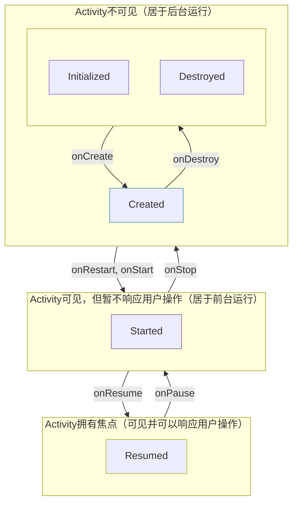
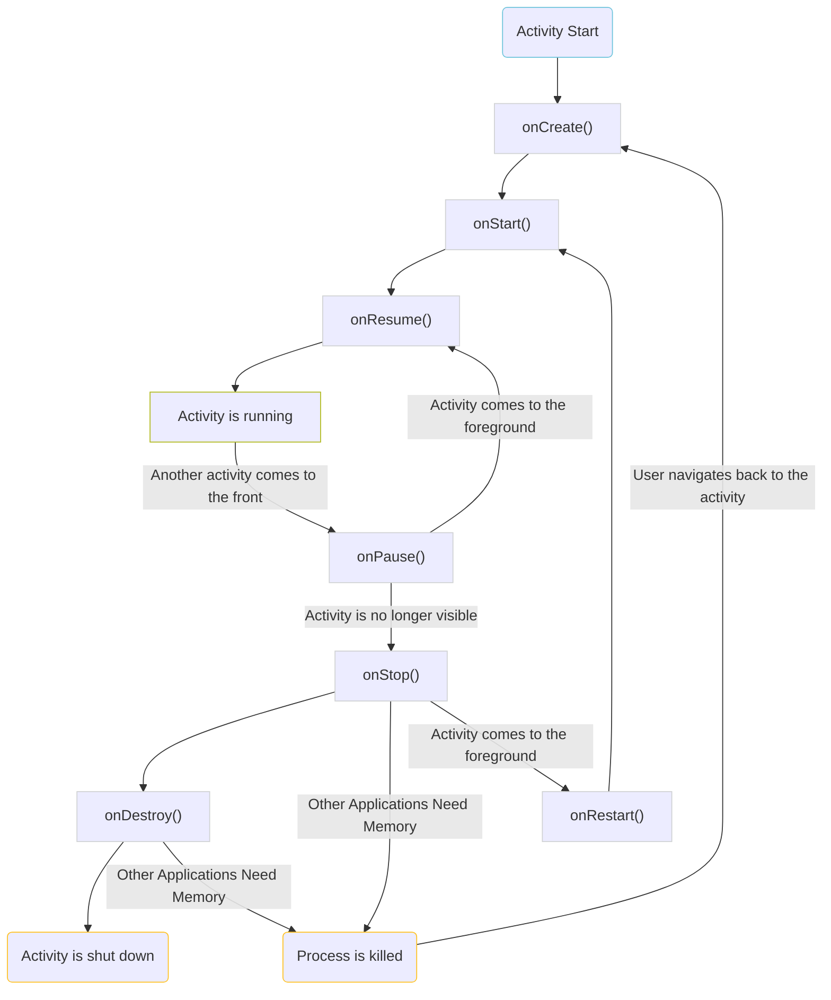
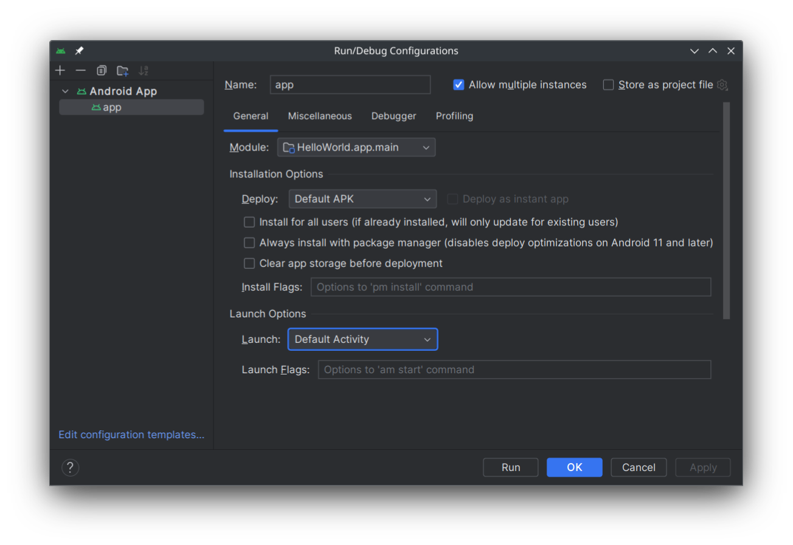
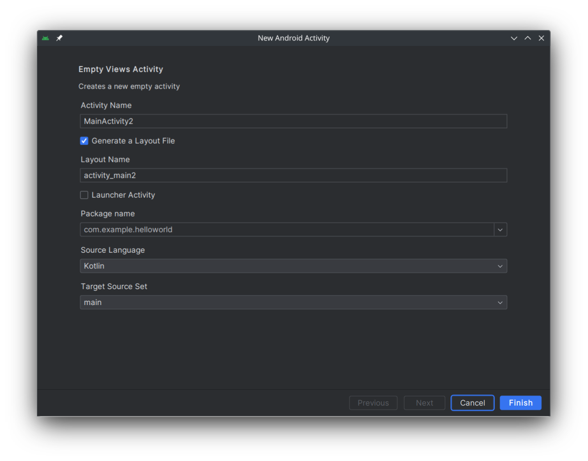

---
author:
- LTSlw
tags:
- android
date: 2024-04-27
lastmod: 2024-05-01
---

# Activity

activity是android应用的基本组成部分，可以创建一个窗口，一个应用可以有多个activity作为入口，启动应用只会启动对应的activity，节约资源，程序通过activity生命周期的多个回调函数运行代码

## 生命周期（lifecycle）

一个activity的生命周期有3种状态：`Created`，`Started`，`Resumed`，在此基础上有7个事件，可以通过回调函数控制



### onCreate

系统创建activity时触发的第一个函数，应该在此初始化基本组件，比如界面。可以使用`setContentView()`设置UI，基本的`onCreate`写法如下

``` kotlin
override fun onCreate(savedInstanceState: Bundle?) {
    super.onCreate(savedInstanceState)     // 调用父类的onCreate，完成创建activity的工作
    setContentView(R.layout.main_activity) // 设置UI

    // 这里添加代码，一般包括读取保存的内容，给其他控件绑定事件（例如响应按钮点击）
}
```

### onStart

在`onCreate`之后运行，activity进入前台，但不能响应用户操作

### onResume

在`onStart`之后运行，用户与activity交互的状态，activity获得焦点

### onPause

activity失去焦点，表示用户正在离开activity。`onPause`执行非常短暂，不一定提供足够的时间来执行保存操作

### onStop

在`onPause`之后运行，activity对用户不再可见，应在此关闭网络活动、保存数据

### onDestroy

在`onStop`之后运行，activity正在被销毁，应在此释放所有资源

*窗口销毁系统不会立即释放所有资源，因为系统认为用户有较大可能短时间内再次打开*

### onRestart

activity正在从stopped状态切换到前台，在`onStart`前运行

### 状态改变

下图展示了何时activity的状态会发生改变以及何时调用回调函数



#### 系统由于内存不足销毁activity

系统内存不足时会杀死进程（不是单独释放activity），越前台的进程越不容易被释放，由于以进程为单位释放内存，应注意保存activity状态

#### finish

`finish()`可以被acticity主动调用，会销毁当前activity，相当于单击返回键

## 保存状态

可以重载`onSaveInstanceState()`函数，将activity需要的数据保存到一个`Bundle`中，在`onCreate()`或`onRestoreInstanceState`中再加载这些数据。可以在activity重新创建时（比如用户旋转屏幕）保持正常显示。由于`onDestroy()`后系统不会立即释放全部资源，因此可能短时间内重启应用也可以保持数据，但是`onSaveInstanceState()`不应用于保存持久性的内容，因为无法预知activity何时被彻底释放

样例代码

``` kotlin
override fun onSaveInstanceState(outState: Bundle?) {
    super.onSaveInstanceState(outState) // 调用父类
    outState?.putInt("score", score)    // 保存score到Bundle
}

// 下面两者实现其一即可
override fun onCreate(savedInstanceState: Bundle?) {
    super.onCreate(savedInstanceState)             // 调用父类
    if (savedInstanceState != null) {              // activity可能是初次启动，之前没有数据保存
        score = savedInstanceState.getInt("score") // 从Bundle中读取score
    }
}

override fun onRestoreInstanceState(savedInstanceState: Bundle?) {
    super.onRestoreInstanceState(savedInstanceState) // 调用父类
    score = savedInstanceState.getInt("score")       // 从Bundle中读取score
}
```

`onRestoreInstanceState()`只在`onStart()`之后且之前有调用过`onSaveInstanceState()`的情况下被调用，所以不用判断是否为`null`

有一些控件在内部已经实现了状态保存，比如`EditText`内输入的内容，不用手动实现

[可能导致activity重新创建的情况](https://developer.android.com/guide/topics/resources/runtime-changes)

## 回退堆栈

Task，每个应用都有一个task，多个activity以栈的结构存放在其中，入口activity第一个进栈，并可能由它启动多个activity，每启动一个activity，就入栈一次，用户按返回键或调用`finish()`就出栈一次，只有栈顶的activity保持活动

一个activity可以有多个实例，可以在`AndroidManifest.xml`中设置[`android:launchMode`](#启动模式)

## 注册activity

所有的activity都要在`AndroidManifest.xml`中注册，activity只有一个必须的属性`android:name`，对应activity的类名

### 导出activity

只有导出的activity才能从外部主动访问，通过设置`android:exported`可以控制activity是否被导出（`true`/`false`）

**出于安全的考虑，应尽量避免导出activity**

### 设置入口点

应用程序入口的activity必须设置属性`android:exported="true"`，并包含以下的\<intent-fliter\>，如果有多个activity包含他，那么第一个包含的activity会被启动

``` xml
<intent-filter>
    <action android:name="android.intent.action.MAIN" />
    <category android:name="android.intent.category.LAUNCHER" />
</intent-filter>
```

调试时，可以选择首先启动的activity



### 启动模式

安卓允许一个activity存在多个实例，可以设置`android:launchMode`管理它的行为，可能的值：

- `standard`：activity可能有多个实例，任何时候只要试图启动activity，就会在回退堆栈添加一个新的activity
- `singleTop`：activity可能有多个实例，如果试图启动activity时，回退堆栈的栈顶恰好就是这个activity，则不会创建新实例，但会调用`onNewIntent()`
- `singleInstance`：一个设备只能存在一个实例，会启动一个新task运行，并且这个task中只会存在这一个activity
- `singleTask`：一个task中只能存在一个实例，切换到它会将其堆栈上方的activity全部弹出
- `singleInstancePerTask`：一个task只能存在一个实例，但可以存在多个包含它的task，会启动一个新task运行，只能作为task的根activity运行，切换到它会将其堆栈上方的activity全部弹出

### parentActivity

设置属性`android:parentActivityName`为一个activity会影响导航，导航栏中会添加一个回退按钮，点击它，如果回退堆栈中存在parentActivity，安卓会弹出parentActivity以上的全部activity。如果回退堆栈中不存在parentActivity，才会回退到启动当前activity的activity（只弹出当前activity）。可以以此制作一个有层级结构的app

[完整的\<activity\>定义](https://developer.android.com/guide/topics/manifest/activity-element)

## 创建activity

创建activity可以手动进行，在代码中创建一个`Activity`类，创建一个布局文件，并在`AndroidManifest.xml`中注册即可

Android Studio也提供了自动化的方式，在菜单中，`File`->`New`->`Activity`可以创建新的activity，Android Studio提供了一些模板，会自动在`layout`中添加布局文文件（一般使用`activity_name.xml`），创建代码文件（一般使用`ActivityName.kt`），并在`AndroidManifest.xml`中注册activity



## 从一个activity启动另一个activity

启动`AnotherActivity`的代码

``` kotlin
val intent = Intent(this, AnotherActivity::class.java)
startActivity(intent)
```

activity之间可以通过`Intent`传递信息

### 向其他activity传递信息

`Intent.Extras`实际是一个`Bundle`，可以使用`putExtra()`和`putExtras()`将一个/多个数据放入`Extra`中

``` kotlin
@Parcelize
class User(var name:String, var age:Int):Parcelable
val user = User("its_name", 10)

// use putExtra()
intent.putExtra("key1", 10)               // 放入一个Int
intent.putExtra("key2", "a_string_value") // 放入一个String
intent.putExtra("key3", user)             // 放入一个User（使用putExtra(String!, Parcelable?)）

// use putExtras()
val bundle = Bundle()
bundle.putInt("key1", 10)                  // 放入一个Int
intent.putString("key2", "a_string_value") // 放入一个String
intent.putParcelable("key3", user)         // 放入一个Object
intent.putExtras(bundle)
```

将数据放入intent之后，调用`startActivity(intent)`会启动一个新的activity，intent中的数据也被一起发送到新activity中，新activity可以使用`intent.get***Extra()`函数获取

``` kotlin
val key1 = intent.getIntExtra("key1")    // 取出一个Int
val key2 = intent.getStringExtra("key2") // 取出一个String
// 出于类型安全的原因从API level 33起使用新API读取Parcelable
// if VERSION.SDK_INT>=33
val key3 = intent.getParcelableExtra("key3", User::class.java)
// if VERSION.SDK_INT<=33
val key3 = val user = intent.getParcelableExtra<User>("key3")
```

### 接收其他activity传回的结果

一种方式是使用`startActivityForResult()`和`onActivityResult()`回调，但这种方式已被废弃，现在应当使用`Activity Result API`实现，不过核心还是要使用`Intent`传递信息

Activity Result API使用`registerForActivityResult()`注册回调。函数接收一个`ActivityResultContract`类（用于约定协议）和一个`ActivityResultCallback`（处理回调），返回一个`ActivityResultLauncher`，调用`ActivityResultLauncher.launch()`启动新activity

一个常用的`ActivityResultContract`是`ActivityResultContracts.StartActivityForResult()`，使用`StartActivityForResult()`注册的`ActivityResultLauncher`需要传入一个`Intent`启动，可以用[上面](#向其他activity传递信息)的方法包含一些新activity需要的信息，回调会传入一个`ActivityResult`作为参数，它包含了两个比较重要的内容

- `resultCode`：Int，标记activity执行的结果，比如成功、用户取消
- `data`：Intent?，返回的结果，可以为空，比如用户取消可能就没必要返回更多的信息

下面是一个简单的例子

``` kotlin
// 使用registerForActivityResult创建launcher
val launcher = registerForActivityResult(ActivityResultContracts.StartActivityForResult()) { result: ActivityResult ->
    if (result.resultCode == Activity.RESULT_OK) { // 如果成功
        // 执行点什么……
    }
}

// 使用launcher启动新activity
val intent = Intent(this, AnotherActivity::class.java)
launcher.launch(intent)
```

#### ActivityResultContracts

`ActivityResultContracts`中包含了一系列android预定义的`ActivityResultContract`，可以用于拍摄照片、打开文件、请求权限等，包括上面的`StartActivityForResult()`也是其中通用性比较高的一个`ActivityResultContract`可以做到

看这些这些预定义的`ActivityResultContract`，可以发现要求传入到launcher和回调函数的参数各不相同，`ActivityResultLauncher()`虽然也可以用于获取相机拍摄的照片，但使用专用的consrtact，回调函数直接就可以得到`Bitmap`，如果需要多次使用还是方便很多的，代码也更加明确

可以去[文档](https://developer.android.com/reference/kotlin/androidx/activity/result/contract/ActivityResultContracts)中查看这些预定义的`ActivityResultContract`

#### 自定义协议

类似`ActivityResultContracts`中的`ActivityResultContract`，也可以自己实现。观察`registerForActivityResult()`的定义，现在还没有解释的东西还剩`I`和`O`。`I`即`input`、`O`即`output`，它们分别对应了输入的类型和输出的类型

``` kotlin
fun <I : Any?, O : Any?> registerForActivityResult(
    contract: ActivityResultContract<I, O>,
    callback: ActivityResultCallback<O>
): ActivityResultLauncher<I>
```

不过，在activity之间传递的还是`Intent`，因此`ActivityResultContract`的工作就是把input在启动新activity时包装进一个`Intent`中发送出去，在activity回传结果时从`Intent`中把output拆出来传给回调函数，分别对应两个必须要实现的方法：`createIntent()`和`parseResult()`

``` kotlin
abstract class ActivityResultContract<I, O> {
    abstract fun createIntent(context: Context, input: I): Intent
    abstract fun parseResult(resultCode: Int, intent: Intent?): O
}
```

`ActivityResultContracts`中的实现就是很好的样例，十几个样例很充足了，建议阅读源码，比如`StartActivityForResult`

``` kotlin
class StartActivityForResult : ActivityResultContract<Intent, ActivityResult>() {
    override fun createIntent(context: Context, input: Intent): Intent = input
    override fun parseResult(resultCode: Int, intent: Intent?): ActivityResult = ActivityResult(resultCode, intent)
}
```

*可能你读源码会发现一个不认识的方法`getSynchronousResult()： getSynchronousResult<O>?`，它会在启动新activity之前被调用，如果返回结果不为`null`，那么不会启动新的activity，而是把`O`直接传入`ActivityResultCallback`，比如用于获取权限的contract如果已经取得权限就可以直接返回成功（感觉用的机会不多，为了明确contract的功能，没放在上面）*

#### 回传信息

直到刚才讨论的都是以各种各样的形式启动一个新activity，优雅地处理返回结果。但是，终归主要任务是在新activity中执行，因此，新activity的决定权也是很重要的，把什么数据回传，还是要新activity说了算

好消息是，回传信息的方式非常统一，还是老样子，activity之间靠`Intent`沟通，因此，回传的数据只要打包一个`Intent`发回去就行了，只需要调用`setResult()`函数即可

``` kotlin
val data = Intent()
// 这里用putExtra()往Intent里放点东西……
setResult(RESULT_OK, data) // RESULT_OK是表示执行状态的Int，也可以定义自己的状态码
finish()                   // 关闭自己
```

## 手工显示向上按钮

``` kotlin
override fun onCreate(savedInstanceState: Bundle?) {
    super.onCreate(savedInstanceState)
    setContentView(R.layout.activity_fourth)

    //在任何情况下，以下语句都会在ActionBar上显示图标
    //但除非在清单中指定了parentActivityName，否则直接点击它是不起作用的。
    //parentActivityName指定的是当Up点击时，显示BackStack中的哪个Activity。
    supportActionBar?.setDisplayHomeAsUpEnabled(true)

    //你可以使用另外一个图标，换掉默认的小箭头图标
    supportActionBar?.setHomeAsUpIndicator(R.drawable.ic_backspace)
}

override fun onOptionsItemSelected(item: MenuItem): Boolean {
    //Up按钮的id是home。
    if(item.itemId == android.R.id.home){
        //通常情况下，Up和Back键的功能应该是一样的
        //所以，在这里，需要finish掉自己
        finish()
    }
    return super.onOptionsItemSelected(item)
}
```

> 以上代码直接取自金旭亮老师的样例代码

## 自定义Activity堆栈

如果需要知道应用的activity堆栈内部的信息，则需要手动维护一个堆栈

- 整个App运行期间，只能有一个实例，因此，它必须是“单例（Singleton）”的，它在内部封装了一个Stack对象
- 当App中使用startActivity和startActivityForResult启动一个Activity时，应自动向这个堆栈中添加新实例
- 当调用Activity的finish()方法销毁它，或者用户使用back键回退时，这个Activity应该会从堆栈中移除

``` kotlin
// AppManager.kt
package com.jinxuliang.actvitystack

import android.app.Activity
import android.app.ActivityManager
import android.content.Context
import java.util.*
import kotlin.system.exitProcess

//一个自定义的App Activity管理器类
//构造函数私有，让外界无法直接实例化它
class AppManager private constructor() {
    //封装一个堆栈，用于保存当前App中所有的Activity对象引用
    private val activityStack: Stack<Activity> = Stack()

    //使用lazy保证整个App运行期间只有一个实例
    companion object {
        val instance: AppManager by lazy {
            AppManager()
        }
    }

    //堆栈中现在有多少个Activity?
    val activityCount: Int
        get() = activityStack.size

    //向堆栈中追加一个Activity
    fun addActivity(activity: Activity) {
        activityStack.add(activity)
    }

    //销毁一个Activity
    fun finishActivity(activity: Activity) {
        activity.finish()
        activityStack.remove(activity)
    }

    //栈顶的Activity是哪个？
    fun currentActivity(): Activity {
        return activityStack.lastElement()
    }

    //清空堆栈，销毁所有的Activity
    private fun finishAllActivity() {
        for (activity in activityStack) {
            activity.finish()
        }
        activityStack.clear()
    }

    //清空堆栈，销毁所有的Activity,杀死进程，安全退出
    fun exitApp(context: Context) {
        finishAllActivity()
        val activityManager = context.getSystemService(
            Context.ACTIVITY_SERVICE
        ) as ActivityManager
        activityManager.killBackgroundProcesses(context.packageName)
        exitProcess(0)
    }

}
```

``` kotlin
// BaseActivity.kt
package com.jinxuliang.actvitystack

import android.os.Bundle
import androidx.appcompat.app.AppCompatActivity

//创建一个自定义的Activity基类，重写其onCreate和onDestory方法
//使用abstract关键字表明这不是一个可以实例化的Activity
abstract class BaseActivity : AppCompatActivity(){

    override fun onCreate(savedInstanceState: Bundle?) {
        super.onCreate(savedInstanceState)
        //将自己加入到Activity堆栈中
        AppManager.instance.addActivity(this)
    }

    override fun onDestroy() {
        super.onDestroy()
        //将自己从Activity堆栈中移除
        AppManager.instance.finishActivity(this)
    }
}
```

``` kotlin
// MainActivity.kt
package com.jinxuliang.actvitystack

import android.content.Intent
import androidx.appcompat.app.AppCompatActivity
import android.os.Bundle
import android.widget.Button
import android.widget.TextView

class MainActivity : BaseActivity() {

    override fun onCreate(savedInstanceState: Bundle?) {
        super.onCreate(savedInstanceState)
        setContentView(R.layout.activity_main)
        val tvInfo: TextView = findViewById(R.id.tvInfo)
        tvInfo.text = "当前Activity栈中有 ${AppManager.instance.activityCount} " +
                "个Activity"
        val btnStartNewActivity: Button = findViewById(R.id.btnStartNewActivity)
        btnStartNewActivity.setOnClickListener {
            //启动一个新的Activity
            val intent = Intent(this, MainActivity::class.java)
            startActivity(intent)
        }
        val btnExit: Button = findViewById(R.id.btnExit)
        btnExit.setOnClickListener {
            //退出整个程序
            AppManager.instance.exitApp(this)
        }
    }
}
```

> 以上代码直接取自金旭亮老师的样例代码
