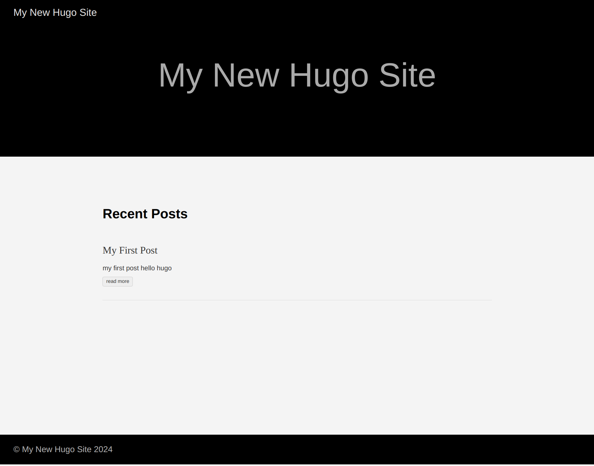

---
author:
- LTSlw
tags:
- mid
- hugo
- blog
- web
- server
date: 2024-03-08
lastmod: 2024-04-10
---

# hugo初体验

如果只是想生成一个简单的站点，可以不求甚解，hugo有丰富的主题可以直接拿来使用

本话会指引你生成一个简单的hugo站点，包含了hugo创建站点的基本流程，说不定你也可以猜到hugo的工作原理和设定

## 创建Site

`site`在hugo中是站点的意思，整个网站都是一个站点，创建site可以使用`hugo new site`命令，例如：

``` shell
hugo new site test-site
cd test-site
```

hugo会在`test-site`下创建一个包含基本目录结构的站点

> 茵蒂克丝 tips：这里可以运行`git init`初始化一个git仓库，方便管理站点

### 使用yaml

由于个人习惯使用yaml，后续教程中的配置都使用yaml，请把`hugo.toml`用yaml重写并重命名为`hugo.yaml`或将后续教程的yaml语法转变为toml。`hugo.yaml`样例:

``` yaml
baseURL: https://example.org/
languageCode: en-us
title: My New Hugo Site
```

相应的，`archetypes/default.md`也改为yaml版本，这里比较特殊，要把`+`全部改为`-`。`archetypes/default.md`样例：

``` yaml
---
title: {{ replace .File.ContentBaseName "-" " " | title }}
date: {{ .Date }}
draft: true
---
```

> 茵蒂克丝：front matter也可以使用`hugo convert toYAML -o .`命令转换

## 配置site

可以在`hugo.yaml`中配置site，可以看到hugo已经帮我们生成了一部分配置

- `baseURL`：站点url前缀，这里要填写这个网站之后会绑定到的域名
- `languageCode`：由[RFC 5646](https://datatracker.ietf.org/doc/html/rfc5646)定义的语言标识，`en-us`表示英文-美国，`zh-cn`表示中文-中国
- `title`：站点标题

## 安装theme

`theme`是主题的意思，一个主题可以包含整个site的样式，决定了整个site的外观，在[官网](https://themes.gohugo.io/)或其他地方有已经做好的各种主题

个人推荐使用hugo mudule管理主题，也可以用git submodule或者将主题整个放在主题同名文件夹里再放到themes文件夹下。下面是使用hugo mudule安装[hyde](https://github.com/spf13/hyde)主题的例子

``` shell
hugo mod init test-site # 如果使用远程仓库，推荐这里设置远程仓库地址，例如：github.com/username/repo
```

在`hugo.yaml`中添加以下内容

``` yaml
module:
  imports:
  - path: github.com/theNewDynamic/gohugo-theme-ananke
```

## 添加content

每个页面都是一个`content`，添加页面可以使用`hugo new content`命令，例如：

``` shell
hugo new content posts/my-first-post.md
```

这条命令会创建`content/posts/my-first-post.md`，最开头有一段自动生成的front matter，可以在后面用一般的markdown语法编写正文

## 预览site

预览site可以使用`hugo server`命令，浏览器打开`http://127.0.0.1:1313`可以看到首页，但上面没有`my-first-post`页面，怎么回事呢？

回到`content/posts/my-first-post.md`，在front matter中把`draft`的值改为`false`，保存

这时重新运行`hugo server`，并刷新页面，`My First Post`就出现了。`draft`表示草稿，设为草稿的页面不会被编译，可以保证半成品页面不会被推送出去，**但也切记要及时把草稿标记移除**



> 茵蒂克丝：hugo server在运行时会检测文件修改，大部分情况下，你不需要重新运行hugo server，刷新页面就能看到最近的更改

## 构建site

虽然`hugo server`已经是一个性能很好的web服务器了，但还是有必要把站点构建之后作为静态页面部署到服务器上，一方面功能更加强大，另一方便也更加安全

hugo把最简短的命令`hugo`留给了构建

构建得到的文件在`public`目录下，把下面的所有文件打包放到各种服务器的网站根目录即可
