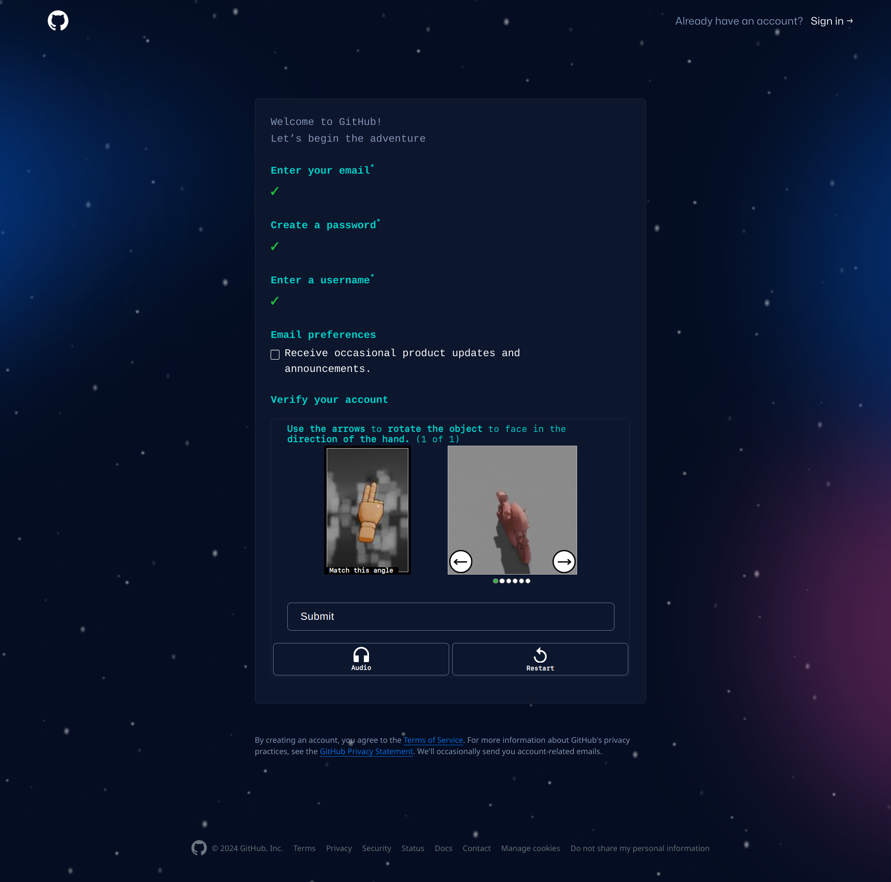
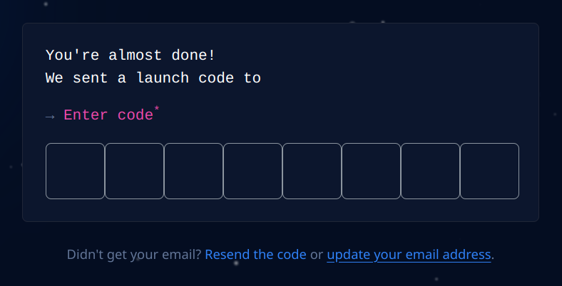
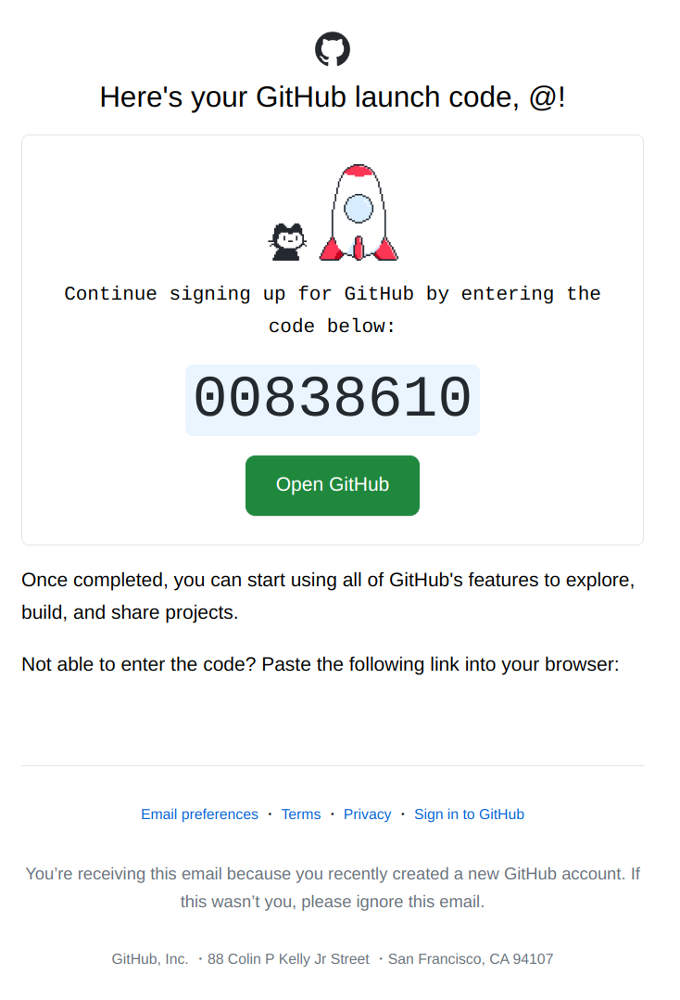
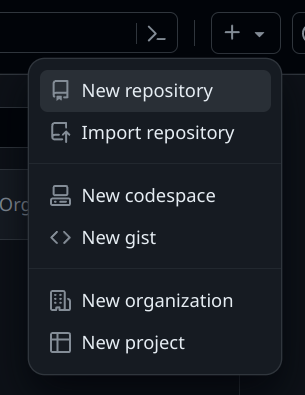

---
author:
- LTSlw
tags:
- git
date: 2024-02-04
lastmod: 2024-02-04
---

# 计协 · 茵蒂克丝 基础篇 - 第3.1话 项目维护与github

## 如何维护项目

### 什么时候提交

一般来说提交应该发生在**逻辑上独立的变更**完成之后（例如增加一个小功能，修复一个bug），而不是在一系列的变更完成之后一次性提交所有变更，即使因为网络或什么原因不能及时和远程仓库同步，也应该分开提交

提交时应该尽量简短地记录提交信息，如果需要记录的信息比较多，那么应该在摘要的第一行只做简单描述，之后留一空行，再在后面做比较详细的描述，一般一行不宜过长

> 茵蒂克丝 tips：推荐在详细描述时使用标号或者缩进区分提交的多个变更，看起来更清楚哦

### 如何管理分支

虽然git没有具体规定分支的用途，但分支已经形成了固定习惯。一般来说一个项目会把分支分为`长期分支`和`主题分支`。要开发特定功能和模块时，先从长期分支上分出一个主题分支，好处是一方面维持长期分支稳定，另一方面把特定主题，统一时间可能有多个主题，独立出来便于协作。在主题分支基本完成之后在合并回长期分支。

具体来说，一种常见实现是使用主分支`master`，从主分支分离出的开发分支`develop`和从开发分支分离的主题分支`topic`分支三种。其中`master`和`develop`是长期分支，`topic`是主题分支，往往有多个，负责不同的功能模块开发。`topic`基本完善后，首先合并到`develop`，`develop`在开发完毕后再合并到`master`。这样的效果是`master`对应的版本一般稳定，`develop`版本一般也能用，且包含最新的特性，但是不一定稳定，`topic`分支分别由不同模块的开发者使用测试，不同模块的开发工作互不影响

### 如何协作开发

上面的技巧和规则可以保证个人项目的维护了，但是一旦涉及协作开发，还需要一套规则来协调不同的开发者。下面简单介绍几个常见的模式，虽然很多情况下通用，但不必完全照搬，可以根据项目实际情况调整，往往是根据项目规模和开发者数量选择一个满足项目管理又不太冗杂的模式

#### 集中式工作流

集中式工作流非常简单，适用于小项目，大多数情况下维护者只有确定的几个人。所有的开发者之间的地位是平等的，允许他们全都直接向远程仓库推送

如果一个开发者想提交到已经被另一个开发者修改过的远程仓库，那么他必须首先拉取仓库并把上一个开发者的修改合并，处理冲突之后再向远程仓库推送

#### 集成管理者工作流

大多数开源项目都采用了这种模式（或者它的变种），集成管理者工作流最大的特点是出现了管理者和官方仓库，其他开发者不能直接操作仓库，要先创建官方仓库的镜像，修改后由管理者裁定要不要合并到官方仓库，最大好处在与它允许不特定的人参与开发

许多代码托管平台（如github）允许以一种很简单的方式——fork镜像官方仓库，原生git可通过设置远程仓库达到同样效果

## Github

事先说明，这里的github泛指代码托管平台，其实功能大同小异，你也可以用其他平台，比如[Gitlab](https://gitlab.com)、[SourceForge](https://sourceforge.net/)，本文使用github演示

可以参考[Wikipedia](https://en.wikipedia.org/wiki/Comparison_of_source-code-hosting_facilities)选择平台

> 茵蒂克丝：gitee这种拙劣模仿还是算了，看commit记录都要逼我登陆

[Github](https://github.com/)是世界最大的代码托管平台，上面有众多优秀的开源项目，免费计划已经很够用，从`Github Student Pack`学生优惠还能免费使用`Pro`计划。无论是托管自己的项目，与别人合作开发，还是寻找开源项目都很方便

本文不会完全介绍所有github功能，没写到的可以查看[官方文档](https://docs.github.com/en)

### 注册

1. 使用Github之前首先要注册账户，进入[首页](https://github.com/)，在导航栏中点击`Sign up`，进入注册界面

2. 按照提示依次输入邮箱、密码和用户名，用户名是你想要在github注册的名字，注册后，平台内你会和这个名字绑定。机器人验证通过后，点击刚出现的绿色按钮`Create accont`

> 茵蒂克丝 tips：如果用教育邮箱以后申请`Student Pack`会方便一些

> 茵蒂克丝：github的验证码真是相当抽象

3. 之后要验证你的邮箱，登陆邮箱之后，收件箱里可以找到github发来的邮件，把里面的验证码填毁注册页

> 茵蒂克丝 tips：邮件找不到去垃圾邮件里看看

4. 后面问为你是学生还是教师之类的问题，不想填下面有个`Skip personalization`跳过

### 简单认识github页面

大部分功能入口都可以在导航栏里找到

点击左侧三横线后会出现`Home`、`Issues`等按钮，方便处理和自己有关的活动，还会显示常用仓库和所属`Teams`

往右是搜索框，可以查找公开项目和代码

再往右的`+`包含了创建仓库，创建`gist`，创建组织等功能

继续向右是`Issues`，`Pull requests`，`Notifications`

最右面点击头像，会出现浏览仓库，账号设置（`Settings`）按钮

### 新建仓库

1. 点击`+` -> 点击`New repository`

2. 填写表单后点击`Create repository`

- `Repository name` - 仓库名，标点符号只允许`-`和`_`
- `Description` - 选填，项目简介，要求简短
- `Public`/`Private` - Public允许所有人查看仓库，被搜索到，`Private`仅授权的贡献者可见
- 后面还有自动添加`README`，`.gitignore`和许可证的选项，可以根据自己的需要选择，默认只创建空仓库

### 2FA （可选）

*需要提前下载[Google Authenticator](https://play.google.com/store/apps/details?id=com.google.android.apps.authenticator2)*

1. 点击头像 -> `Settings`

2. 在左侧点击`Password and authentication` -> 右侧点击`Enable two-factor authentication`，之后会要求输入密码

3. 用Authenticator扫描二维码，并把扫描后得到的验证码填入输入框

4. 下载恢复密钥并妥善保存，可以在无法登陆账号时验证身份

### 将github作为远程仓库

- 如果本地已经有仓库，可以使用`git remote add`命令

- 如果本地没有现有仓库，可以直接使用`git clone`命令克隆仓库

一般推荐直接使用https连接github

如果设置了2FA，操作`Private`仓库或提交时不能直接用密码登陆，要先按下面步骤操作

1. 点击头像 -> `Settings`

2. 在左侧点击`Developer settings`

3. 在左侧点击`Personal access tokens` -> 点击`Tokens (classic)` -> 右侧点击`Generate new token` -> 点击`Generate new token (classic) `

4. 填写表单，`Note`简述用途，`Expiration`不建议设为永久，下面权限按照需要选取，如果只是提交更改，只勾选`repo`即可

5. 点击`Generate token`，屏幕上会出现token，但只会出现这一次，以后不能查看，需要自己记住

6. 本地git要求输入密码时，可用token代替密码输入

### 贡献其他项目

如果在使用开源项目时，发现bug，有时候问题并不复杂，你debug之后，想要提交到原来的仓库，该怎么办呢

上文[集成管理者工作流](#集成管理者工作流)，在github中很容易实现，可以借由`fork`和`pull request`来实现

1. 进入你想贡献的github页面，点击右上方fork按钮 -> 填写表单并点击`Create fork`

2. 将修改提交到自己的fork仓库

3. 点击`Contribute` -> 点击`Open pull request` -> 在表单中描述做出的修改并点击`Create pull request`

4. 等待项目管理人员回与合并

### Issues

这是集成在github中的bug追踪系统，每个仓库都有一个，如果发现bug，就可以在里面反馈

首先应该查看bug是不是已经被反馈过，如果已有反馈，在下面跟帖就行了，可以补充之前讨论中缺少的信息，或者推测bug产生原因，没有相同反馈再开新issue，要尽量包括详细的信息帮助开发者复现bug，比如使用的硬件和软件环境、软件运行产生的日志、用主要维护者使用的语言反馈

注意，反馈问题是要保持礼貌，我们不应该要求开源项目维护者秒修bug，大部分时候他们的工作是无偿的，逻辑上开发者甚至有权不修bug

另外，issues仅应用于反馈bug，因为github会给维护者发送邮件和通知，发送无关信息就是骚扰

### Discussions

discussions提供用户讨论，和issues相比和一般意义上的论坛更相似，讨论话题更为宽松，虽然免费，但要求维护者手动打开，不一定每个仓库都有
